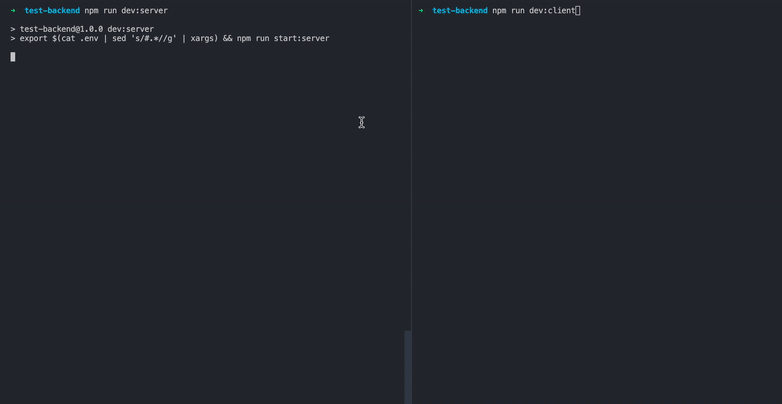

# Backend test



## Описание

Клиент и сервер для сбора статистики скорости ответа сайта

### Клиент

- Клиент запрашивает `PING_URL` и как только получает ответ, отправляет его серверу.
- Клиент умеет переотправлять недоставленные сообщения с экспоненциальной задержкой.
- Если сервер долго не отвечает, то клиент разрывает соединение через 10 секунд.
- При остановке клиента, клиент выводит в консоль статистику обращений к серверу.

### Сервер

- Сервер принимает JSON методом `POST` на эндпоинт `/data`.
- В 60% случаев он отвечает `OK`.
- В 20% случаев отвечает `500` ошибкой.
- В 20% случаев "зависает" не отвечая ничего и не закрывая соединение.
- Сервер логгирует в терминал все полученные сообщения (те, на которые ответил `OK`).
- При остановке сервер выводит среднее и медианное время пинга.

## Сборка

Установите зависимости:

```
npm install
```

Создайте в корне проекта файл `.env` с основными настройками:

```
PING_INTERVAL=1000
PING_URL='https://fundraiseup.com/'
SERVER_URL='http://localhost:8080/data'
SERVER_PORT=8080
SERVER_TIMEOUT=10000
MAX_DELIVERY_ATTEMPT=10
```

Собираем приложение (typescript):

```
npm run build
```

## Запуск

Сначала запускаем сервер для приема сообщений:

```
npm run dev:server
```

После старта сервера запускаем клиент:

```
npm run dev:client
```
